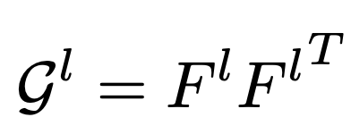
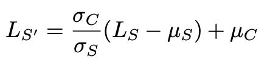

# STYLE TRANSFER - DLAI TEAM #5
This project is carried out by ETSETB students for the Deep Learning for Artificial Intelligence course. The team is formed by Clara Rendé, Cristian Cuadrado, Marc Hernandez and Guillem París.

Our [notebook](https://telecombcn-dl.github.io/2018-dlai-team5/)

## Index:
1. Goals
2. What is Style Transfer?
3. Types of style transfer studied
4. Basic Neural Style Transfer

      * CNN Structure
      * Loss functions
      * Gram Matrix
      * Main hyperparameters
5. Improved Neural Style Transfer
6. Fast Neural Style Transfer
7. Arbitrary Neural Style Transfer
8. Results
9. Conclusions
10. Further Steps
11. References

## Goals:
- Understand the basics of Neural Style Transfer (NST)
- Experiment with the different hyperparameters
- Study the different NST techniques: Improved, Fast & Arbitrary Fast Style Transfer

## What is Style Transfer?
Neural style transfer is an optimization technique used to blend an input image (usually random noise) such that it is transformed to look like the content image but "painted" in the style of the style image.

## Types of style transfer studied
- Basic Style Transfer
- Improved Style Transfer
- Fast Neural Style Transfer
- Arbitrary Neural Style Transfer

## Basic Neural Style Transfer

### Structure and Feature Extraction
When working with image-wise neural networks, convolutional layers and maxpooling are tipycally used. Also, since they may be costly to train, pre-trained networks (such as VGG16 & VGG19) are useful because they already have been trained to extract features of the input images.

By means of convolutions, the first layers extract the lowest level features (pixel-level). The deeper the layer, the higher the level of the feature extracted. For example, in the last layers it can be seen how the network extracts features such as ears, mouths, etc. 

To represent the **content image**, a deep layer is used. Deeper (or last) layers in the network capture the high-level content in terms of objects and their arrangement in the input image but do not constrain the exact pixel values of the reconstruction. In contrast, reconstructions from the lower layers simply reproduce the exact pixel values of the original image.

To represent the **style image**, which is defined as the artistic features such as textures, pattern, brightness,etc., it is mandatory to employ a feature space originally designed to capture texture information. As texture have different detail levels, this information is not located in just one layer. Therefore, the first convolutional layer of each block are used to achieve a representation in all detail levels. Correlations between the different filter responses over the spatial extent of the feature maps are calculated. By including the feature correlations of multiple layers, it is obtained a stationary, multi-scale representation of the input image, which captures its texture information but not the global arrangement.

### Loss Functions
The principle of neural style transfer is to define two loss functions, one that describes how different the content of two images are, Lcontent, and one that describes the difference between the two images in terms of their style, Lstyle. Then, given three images, a desired style image, a desired content image, and the input image (initialized with the content image or some noise), we try to transform the input image to joinly minimize the content distance with the content image and the style distance with the style image.
In summary, we’ll take the base input image, a content image that we want to match and the style image that we want to match. We’ll transform the base input image by minimizing the content and style distances (losses) via backpropagation, creating an image that mixes the content and the style of both images.

Notice the parameters Alpha and Beta, which are the weighting factors for content style reconstruction. It will be the proportion between content and style weights what will determine if the result prioritizes the content or the style. Also notice that what really matters is the proportion between them, that is why in some equations we find just one parameter (in those cases we assume Beta = 1).

  
  
  

The layers used in this Basic NST implementation for Style Loss Function are: conv1_1, conv2_1, conv3_1, conv4_1, conv5_1.

### Gram Matrix
The Gram Matrix is used to compare both the style image and the output one, layer by layer. The **style representation of an image** is described as the correlation of the different convolutional filter responses given by the Gram matrix.

For example, given the first layer of the network, a CxHxW vector space is obtained, where C is the number of filters, H is the height of the image and W the width. From these parameters, we compute the Gram Matrix by computing the dot product between different rows, in order to see which features tend to occur at the same time -i.e. which neurons are activated simultaneously.

  

where Gˡ is the inner product between both vectorized feature maps in layer l. Gˡ, generated over the feature maps for a given image, represents the correlation between feature maps i and j.

### Main hyperparameters
The following hyperparameters can be used to modify the output of the transfer style. Differents tests have been done changing the different default values and will be discussed in the results section.

- Content weight: weight of the content image in the generated image. Value by default: 0.25.

- Style weight: weight of the style image in the generated image. Value by default 1.

- Total variations weight: Total variation loss is the sum of the absolute differences for neighboring pixel-values in the input images. Smaller values tend to produce sharper images. Value by default: 8,5e-5

- Image size: size of the generated image. Value by default: 224x224x3

- Content layer: Layer from the model used to evaluate similarity between content image and generated image. Value by default: conv4_2

- Feature layers: Layers from the model used to evaluate similarity between style image and generated image. Value by default: conv1_1, conv2_1, conv3_1, 'conv4_1, conv5_1.

- Pool type: use max pooling or average pooling in the model. Value by default: Max pooling

- Initial image: define the initial image that will be modified at each iteration. 

- Preserve color: apply modifications in image style in order to preserve color from the content image. By default this option is off.

## Improved Neural Style Transfer
This is a variation of the basic neural style transfer. The main improvements are:

- **Geometric layer weight adjustment for style inference**: The separation between style and content is reduced by using the same layers for both of them (instead of just one for content and a bunch for style). Since the content/style information is gathered in different layers, the following geometric weighting is applied:

  

Where D is the number of layers and d(l) is the deepness of the layer l with respect to the total number of gathered layers. Notice that the style weight decreases with the deepness of the layer whereas the content one increases. This make sense, since the high level features (which are useful for the content information) are gathered in the deeper layers. This improvement increases the quality of the output image.

- **Using all 16 convolutional layers of VGG-19 for style inference**: Instead of using just some layers for the style feature extraction, the paper proposes to use all the convolutional layers of the VGG19.
          
- **Activation Shift of gram matrix**
In general, the outputs of the image are scarce: in all the layers, each filter has few activations different from the    spatial dimensions. This results in the scattering of the Gram matrices, at the expense of the transfer quality of the style. Gram matrices contain a large number of zero entries, leaving too much freedom for the optimization procedure to interpret them incorrectly. This problem can be reduced by applying changed activations to eliminate dispersion.

| Original Gram Matrix | Gram Matrix with Shift activation |
|:--------------------:|:---------------------------------:|
|

|

|  

- **Correlation Chain**
Style information is captured by a set of Gram matrices calculated through correlations within the same layer. 
The correlation chain consists of adding correlations between neighbor layers.

- **Color preservation**
Luminance channels (LS and LC) are first extracted from the style and content images to produce an output luminance image LT. This transformation is applied before running the Style Transfer algorithm.  Using the YIQ color space, the color information of the content image is represented via the I and Q channels; these are combined with LT to produce the final color output image. 
Being µS and µC the mean luminance of the two images and σS and σC their standard deviations, each luminance pixel in the style image is updated as:

  

There are others ways to implement Color Preservation in Style Transfer, but here it is explained the one it has been implemented.

These improvements have been implemented in this [notebook](https://colab.research.google.com/drive/14rGJRCrlF8-Mhalebf4mfUK_zua1c6cn).

## Fast Neural Style Transfer
This technique aims to reduce drastically the time needed to perform the styled results by the original NST algorithm. 

The technique consists on creating a feed-forward neural network, called Image Transform Network, which will be fed with the content image. This network will be trained to joinly minimize the content and style loss functions from the already-known VGG16, learning how to transform the input content image to the styled output of the VGG16.

Not only both techniques (fast and original) are similar in terms of quality, but also FNST is ~1000x times faster. However, the Image Transform Network has to be trained for each style image, limiting this technique by losing the flexibility to combine two arbitrary images.

The network consists on (1) the Image Transformation Network and (2) the Loss Network.

  

**1. Image transformation network**
The image transformation network is a deep residual CNN. Each block have the following structure:

  

This network comprises five residual blocks. The first and last layers use 9×9 kernels; all the other convolutional layers use 3×3 kernels.

**2. Loss network**
Loss function computes a scalar value measuring the difference between the output image and a target image. The Image Transformation Network is trained using stochastic gradient descent to minimize a weighted combination of both already-known loss functions (style and content).

# ?AIXO VA ABAIX?
Instance Normalization is used to replace batch normalization. While batch normalization applies the normalization to a whole batch of images, instance Normalization works for a single image separately. The objective is to replace every batch normalization in the generator network with the instance normalization in order to prevent instance-specific mean and covariance shift simplifying the learning process.

Batch Normalization

  

Instance Normalization

  

Where: 
T: batch size;
W: image weight;
H: image height

## Arbitrary Fast Neural Style Transfer
This technique aims to tackle the previous FNST problem: the style-per-style training, which forces the Image Transformation Network to be trained for each different style image. This solution combines the flexibility of the basic NST and the speed of the Fast NST.

Also, after training this network with a large number of style paintings, the algorithm is capable of synthetizing new styles never previously observed. 

The structure is based on 3 modules: (1) The Style Prediction Network, (2) the Style Transfer Network and (3) the Loss Network. This model provides a generic representation for artistic styles flexible enough to capture new artistic styles much faster than a single-purpose network.

- **Style transfer network**

This first component is the already explained Style Transformation Network of the previous section. In this case, however, the CNN must be formulated structured as an encoder/decoder, which will help embedding the information of the image in a few units. 

The study argues that the mean and variance of those few activations (smaller in terms of dimensions than the original image) is unique for each style image. Therefore, the goal is to predict these two parameters for any given style image.

- **Style prediction network**

This network tries to predict the aforementioned parameters. It is trained to compute the conditional instance normalization, which is based on applying a normalization with parameters that are specific for each style transfer. 

  

Where 'mu' is the mean, 'sigma' is the standard deviation and 'beta' and 'gamma' are learned by the neural network. Beta is the learned mean and gamma is the learned standard deviation of the unit.

The style prediction network is implemented using convolutional layers and residual blocks.

- **Loss network**

The loss function is calculated applying the structure previously defined and uses the VGG16 architecture. 

  

## Results
All the results have been stored in the Results folder and explained in the [RESULTS.md](Results/RESULTS.md) document, located inside it.

## Conclusions
The project is concluded as follows:

The team has studied several Neural Style Transfer techniques. Each one has its main advantages and disadvantages**:

|                    | Quality (1-5) | Time (1-5) | Different Style Images |
|--------------------|:-------------:|:----------:|:----------------------:|
| Basic NST          |       4       |      2     |           YES          |
| Improved NST       |       5       |      3     |           YES          |
| Fast NST           |       3       |     5*     |           NO           |
| Arbitrary Fast NST |       3       |     5*     |           YES          |

*After the Style Transformation Network has been trained.

** Please, note that the previous table is built subjectively. 

The main idea is that the Basic and Improved NST techniques yield to high-quality results after some iterations which try to jointly minimize both content and style loss. Between these two, the main difference would be the quality (thanks to the improvements implemented) and the time per iteration (which is reduced in the improved version).

Regarding the Fast NST, both result in a faster style image transformation by training a previous network with a given style. After the network (Style Transformation Network or STN) is trained, the style can be applied instantaniously to any content image. In the case of the Arbitrary, another network (Style Prediction Network) is trained in order to extract the main parameters via the conditional instance normalization, which are then passed to the STN in order to apply any given style to any given content instantaneously.

This project has helped us learn the intrinsics of Neural Style Transfer and the state-of-the-art techniques in the field. Some of us started the project with little or almost none experience with Deep Learning and the Colab implementations -learning from the very lowest level- plus the cloud platform management -useful when dealing with complex Deep Learning problems- and the research performed, have helped us gain experience in this area. 

## Further Steps
If the team continued with the project, the main steps would be:

1. Implement the Fast and Arbitrary Fast NST versions via Colab to gain insights of how the Style Transfer Network and the Style Prediction Network work jointly with the VGG19 in order to obtain instantaneous style transformations.
2. Apply FNST and AFNST to real time video.
3. Check the feasibility of data augmentation techniques by using NST.

## References
- Basic Style Transfer & Improved Style Transfer: https://github.com/titu1994/Neural-Style-Transfer
- Improved Style Transfer: https://arxiv.org/pdf/1605.04603.pdf
- Color preservation: https://arxiv.org/pdf/1606.05897.pdf
- Perceptual losses for Real-Time Style Transfer and Super-Resolution: https://cs.stanford.edu/people/jcjohns/papers/eccv16/JohnsonECCV16.pdf
- Instance Normalization: The Missing Ingredient for Fast Stylization: https://cs.stanford.edu/people/jcjohns/papers/eccv16/JohnsonECCV16.pdf
- Arbitrary Fast Style Transfer: https://arxiv.org/pdf/1705.06830.pdf , https://github.com/tensorflow/magenta/tree/master/magenta/models/arbitrary_image_stylization
- A Neural Algorithm of Artistic Style: https://arxiv.org/pdf/1508.06576.pdf

